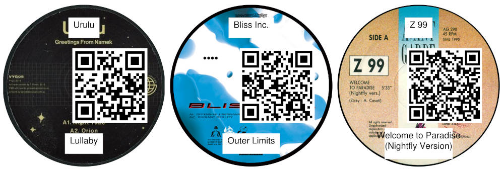

# Schallpappenspieler



A new audio media based on cardboard to play music from.

## Technology

QR-code controlled Mixxx loader (live camera) and a CLI generator for printable song cardboar patches using content from discogs.

## How-to

1. Install software

Requirements
- Linux based system
- Xorg session (Wayland not supported for UI automation).
- `xdotool` and `wmctrl` installed.
- Python 3.11+.
- uv package manager

Install dependencies
```bash
uv sync
```

2. Create playlist of your songs to be used on cardboards and save as m3u file.

3. Create discogs api token : https://www.discogs.com/settings/developers and save token to `.env` file.

4. Create cardboard song patches:
```bash
uv run schallpappenspieler-patches --config config.toml --m3u path/to/list.m3u --cover-source discogs
```

5. Cut 65mm cardboard discs and glue patches on cardboards.

6. Use your fresh pressed Schallpappen with the `schallpappenspieler` application:

```bash
# start scanner
uv run schallpappenspieler --config config.toml
# start mixxx
mixxx
```

## Notes
- Mixxx must run under X11/XWayland.
- Key bindings in `config.toml` must match Mixxx shortcuts.
- QR scan backend defaults to OpenCV; set `qr.backend = "pyzbar"` if you install `pyzbar`.
- Fix possible xdotool remote control problems: `xhost +SI:localuser:$USER`
- Maybe remote control needs to be activated in your OS!
- Mixxx sometimes needs to be start with explicit remote controllable platform: `QT_QPA_PLATFORM=xcb mixxx`
